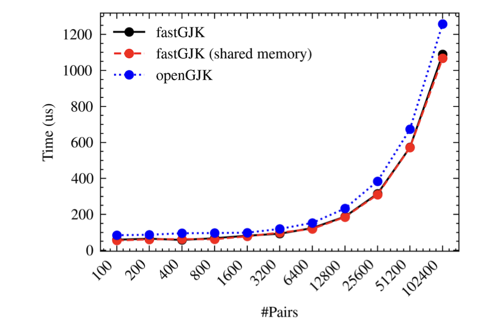

# FastGJK

FastGJK is a header-only library implementing CUDA-accelerated GJK and EPA (TODO) algorithms.

# Build
To build examples/tests/benchmarks:
```bash
cmake -B build [-D<build_option>=<value>...]
cmake --build build
```

The following table lists the build options:
|  Build option   | Default value  | Description |
|  ----  | ----  | ---- |
| `FASTGJK_BUILD_TESTS=ON/OFF`  | `ON` | Build unit tests |
| `FASTGJK_BUILD_BENCHMARKS=ON/OFF` | `ON` | Build benchmark programs |
| `FASTGJK_LARGE_DATASET=ON/OFF` | `OFF` | Use a large dataset (100,000 samples) for testing and benchmarking |

# Unit tests
To run a test suite:
- GJK tests: `./build/tests/testGJK`
- GJK tests with large dataset (`FASTGJK_LARGE_DATASET=ON`): `./build/tests/testGJK_large`

# Benchmarks
We use [NVIDIA nvbench](https://github.com/NVIDIA/nvbench) to benchmark our kernels across the parameter space. To run benchmarks:
```bash
./build/benchmarks/benchGJK
```

# Profiling
To profile kernels:
```bash
./scripts/profile.sh
```

# Performance
FastGJK achieves an average speedup of 10% over the CUDA implementation of the open-source [openGJK](https://github.com/MattiaMontanari/openGJK).




# Acknowledgements
Our code borrows heavily from [OpenGJK](https://github.com/MattiaMontanari/openGJK).